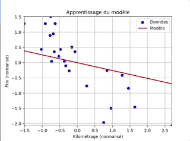
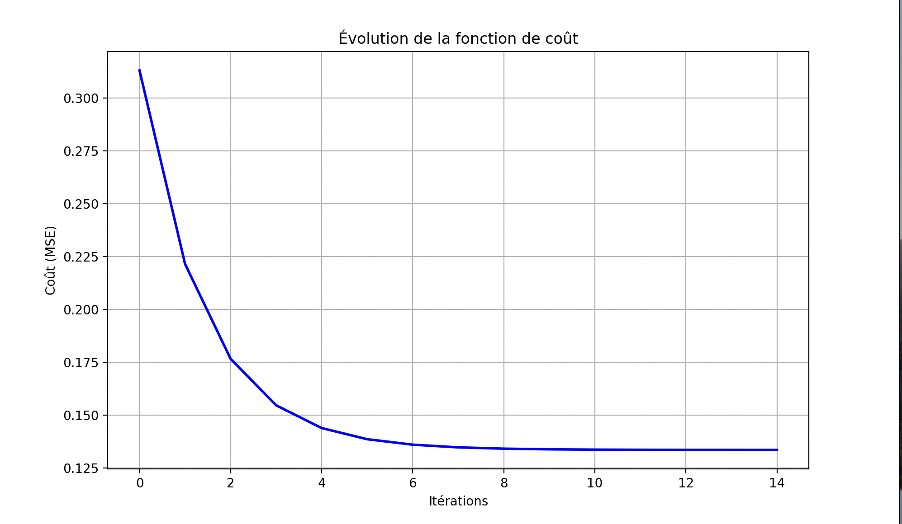

# Linear Regression Project 🚗📈

    

## 📖 Project Description
This project implements **linear regression from scratch** using a single feature: the **mileage of a car**.  
The goal is to predict a car's price based on its mileage.

The project consists of **two main programs**:

1️⃣ Predictor (predict.py)

    Prompts the user for a mileage and returns the estimated price.
    Formula used:
    estimatePrice(mileage) = θ0 + θ1 * mileage

2️⃣ Trainer (train.py)

    Reads a dataset containing mileage and price.
    Performs linear regression using gradient descent.
    Saves theta0 and theta1 for the predictor program.

---

## 🛠 Implementation Details

- Hypothesis function:

        estimatePrice(mileage) = θ0 + θ1 * mileage
  
- Gradient descent updates:

      tmpθ0 = learningRate * (1/m) * sum(estimatePrice(mileage[i]) - price[i])
      tmpθ1 = learningRate * (1/m) * sum((estimatePrice(mileage[i]) - price[i]) * mileage[i])
    Where m = number of data points.  
    theta0 and theta1 are updated simultaneously.
    
- Training procedure:  
      Initialize theta0 and theta1 to 0
      Loop over the dataset and update parameters using the formulas above
      Save the final theta0 and theta1
---

## 🎁 Bonus Features

Click to expand 🎨

    - Plot dataset points to visualize mileage vs. price
    - Plot the regression line on the same graph
    - Calculate the precision of the algorithm

---

## 🚀 How to Use

1️⃣ Train the model

    python train.py dataset.csv

    - Input: CSV file with mileage and price
    - Output: Saved theta0 and theta1

2️⃣ Predict a car price

    python predict.py

    - Enter mileage when prompted:
      Enter mileage: 15000
    - Output: Estimated price

3️⃣ (Optional) Visualize results

    python plot.py dataset.csv

    - Shows a graph with data points and regression line

---

## 📊 Demo

   
---

## ⚙ Requirements

    - Python 3.x
    - Optional for plotting:
      pip install matplotlib pandas

---

## 🖋 Author
**Grégoire Gobert**

---

## 📝 Notes

- Linear regression is implemented **from scratch** without any ML libraries
- Ideal for learning **gradient descent** and model training fundamentals
